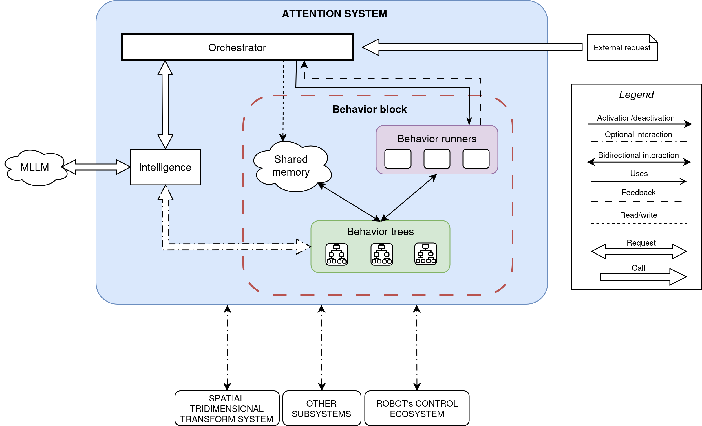

# attention_system


This repository contains the ROS 2 packages developed for an autonomous attention system for social robots. The system allows an external robotic architecture to request attention, while the internal components select, prepare and execute the most suitable attention behavior using MLLM-based reasoning and Behavior Trees.



## Documentation index

- [docs/ROS_INTERFACES.md](docs/ROS_INTERFACES.md): public ROS nodes, services, topics and actions exposed by the system.
- [docs/ADDING_ATTENTION_BEHAVIORS.md](docs/ADDING_ATTENTION_BEHAVIORS.md): checklist for adding a new attention behavior.
- [docs/VALIDATION_AND_TROUBLESHOOTING.md](docs/VALIDATION_AND_TROUBLESHOOTING.md): validation commands and common runtime issues.

## Contents

- [Main features](#main-features)
- [Repository structure](#repository-structure)
- [Available attention behaviors](#available-attention-behaviors)
- [Usage](#usage)
  - [Compilation](#compilation)
  - [Quick start](#quick-start)
  - [Running the system](#running-the-system)
    - [Attention system](#attention-system)
    - [MLLM](#mllm)
    - [Attention actuation](#attention-actuation)
    - [Auxiliary perception system](#auxiliary-perception-system)
- [Troubleshooting](#troubleshooting)

## Main features

- ROS 2-based modular attention system.
- Attention behavior selection using MLLM-based reasoning.
- Attention behaviors implemented with Behavior Trees.
- Behavior orchestration, execution supervision and failure notification.
- Support for local and remote MLLM backends.
- Basic perception and actuation components for validation on TurtleBot 2 and NAO robot.

## Repository structure

The repository is organized into five main blocks: the core attention system, the attention behaviors, platform-specific actuation components, auxiliary perception components and MLLM management tools.

| Package                                                                | Description                                                                                                                                                                   |
| ---------------------------------------------------------------------- | ----------------------------------------------------------------------------------------------------------------------------------------------------------------------------- |
| `attention_system_core/attention_system`                               | Core implementation of the attention system. It contains the attention orchestrator, the intelligence node, launch files and configuration files for the available behaviors. |
| `attention_system_core/attention_system_interfaces`                    | ROS 2 interfaces used by the core system, including the service used to request attention and the messages used to describe attention behaviors and system status.              |
| `attention_system_behaviors`                                           | Behavior Tree XML files and custom BehaviorTree.CPP nodes used to implement the attention behaviors.                                                                          |
| `attention_actuation/attention_actuation_msgs`                         | ROS 2 interfaces used by the actuation components, including tracking and body-turning requests.                                                                              |
| `attention_actuation/kobuki_attention_actuation`                       | Actuation implementation for TurtleBot 2/Kobuki. It provides a node for tracking a TF by rotating the mobile base.                                                            |
| `attention_actuation/nao_attention_actuation`                          | Actuation implementation for NAO, including components for TF tracking with the neck and body turning with neck compensation.                                                 |
| `llm_management/llm_router/llm_router`                                 | Router node that exposes a common ROS 2 interface for querying different MLLM backends.                                                                                       |
| `llm_management/llm_router/llm_router_msgs`                            | ROS 2 service interface used by the LLM router.                                                                                                                               |
| `llm_management/gemini_bridge/gemini_bridge_interfaces`                | ROS 2 service interface used by the Gemini bridge.                                                                                                                            |
| `llm_management/gemini_bridge/google_gemini_bridge_cpp`                | C++ bridge used to send requests from ROS 2 to a remote Gemini model.                                                                                                         |
| `auxiliar_perception/attention_perception_launchers`                   | Launch package for starting the auxiliary perception components required by the implemented behaviors.                                                                        |
| `auxiliar_perception/omdet_turbo/omdet_node`                           | Open-vocabulary object detection node based on OMDet Turbo.                                                                                                                   |
| `auxiliar_perception/omdet_turbo/omdet_node_msgs`                      | ROS 2 service interface used to change the visual detection prompt.                                                                                                           |
| `auxiliar_perception/simple_perception/attention_aux_perception_msgs`  | ROS 2 service interfaces used by the auxiliary perception nodes.                                                                                                              |
| `auxiliar_perception/simple_perception/attention_aux_perception_nodes` | Auxiliary nodes that project 2D detections into 3D references and publish TFs associated with visual detections.                                                              |

## Available attention behaviors

The current behavior catalogue is loaded from `attention_system_core/attention_system/config/attention_orchestrator_params.yaml`.

| Behavior | Behavior runner | Required capabilities | MLLM inputs | Purpose |
| -------- | --------------- | ------------------- | ----------- | ------- |
| `TrackUnknownDetectionRot` | `attention_track_unknown_detection_rot` | `turn_around` | `<int>id`, `<string>class` | Track one visual detection by class and id while rotating the robot/body toward it. |
| `TrackDetectionsSameClassMidpointRot` | `attention_track_detections_same_class_midpoint_rot` | `turn_around` | `<string>class`, `<int>n_detections` | Track the midpoint of several detections of the same visual class. |
| `TrackJointArt` | `attention_track_joint_art` | `use_joint` | `<string>joint_frame` | Track one robot joint frame when the robot should maintain visual contact with part of itself. |

## Usage

### Compilation

The following commands set up a ROS 2 Jazzy workspace for this repository, fetch the required dependencies, and build the packages included in the workspace. These instructions assume that ROS 2 Jazzy is already installed and properly configured.

If no ROS 2 workspace has been created:
```sh
mkdir <path_to_workspace>/<workspace> && mkdir <path_to_workspace>/<workspace>/src
```

Clone the repository into the workspace:
```sh
cd <path_to_workspace>/<workspace>/src
git clone https://github.com/geriabot/attention_system.git
```

Install dependencies:
```sh
cd <path_to_workspace>/<workspace>/src

# General dependencies
vcs import . < attention_system/thirdparty.repos

# Dependencies used only by google_gemini_bridge_cpp
cd attention_system/llm_management/gemini_bridge/google_gemini_bridge_cpp/
vcs import . < thirdparty.repos

# Third-party dependency installation
cd <path_to_workspace>/<workspace>/src
source /opt/ros/jazzy/setup.bash
rosdep install --from-paths src --ignore-src -r -y
```

Build the workspace:
> When building the `llama_ros` package, if the `CUDA` GPU accelerator is going to be used for inference, the build must be run with the `DGGML_CUDA=ON` flag.
```sh
cd <path_to_workspace>/<workspace>
source ~/scripts/ros2/source_jazzy.sh

# Without CUDA for llama_ros
colcon build --symlink-install --cmake-args -DCMAKE_EXPORT_COMPILE_COMMANDS=ON

# With CUDA for llama_ros
colcon build --symlink-install --cmake-args -DCMAKE_EXPORT_COMPILE_COMMANDS=ON -DGGML_CUDA=ON
```

### Quick start

Run each block in a different terminal. Source ROS 2 Jazzy and the workspace first in every terminal:
```sh
source /opt/ros/jazzy/setup.bash
source <path_to_workspace>/<workspace>/install/setup.bash
```

1. Start the MLLM router:
```sh
ros2 run llm_router llm_router --ros-args -p mode:=<local/remote-gemini>
```

2. Start one MLLM backend:
```sh
# Remote Gemini backend
export GOOGLE_GEMINI_API_KEY=<your_api_key>
ros2 run google_gemini_bridge_cpp gemini_bridge_node --ros-args -p model:=gemini-2.5-flash-lite

# Local llama_ros backend
# TODO: Add a validated local model YAML file path for this repository.
ros2 llama launch <path_to_model_yaml_file>
```

3. Start auxiliary perception:
```sh
ros2 launch attention_perception_launchers auxiliar_perception.launch.py
```

4. Configure and activate `/omdet_node`:
```sh
ros2 lifecycle set /omdet_node 1
ros2 lifecycle set /omdet_node 3
```

5. Start one actuation backend:
```sh
# TurtleBot 2/Kobuki
ros2 launch kobuki_attention_actuation kobuki_attention.launch.py

# NAO
ros2 launch nao_attention_actuation nao_attention.launch.py
```

6. Start the attention system:
```sh
ros2 launch attention_system attention_system.launch.py
```

### Running the system

In different terminals you should launch the different launchers depending on the selected MLLM backend, perception mode and robot platform.

> First of all, in all terminals, be sure ROS 2 Jazzy and the workspace where this repository is located are sourced:
> ```sh
> source /opt/ros/jazzy/setup.bash
> source <path_to_workspace>/<workspace>/install/setup.bash
> ```

#### Attention system

Attention system (`/attention_orchestrator`, `/attention_intelligence`, `/attention_system_bt_node`, and behavior runners):
```sh
ros2 launch attention_system attention_system.launch.py
```

The launcher starts the generic `behavior_architecture` `mission_executor` with two configuration files from the `attention_system` package. Together, these files describe both the Behavior Tree runtime and the attention-specific behavior selection data.

<details>
<summary>Launcher arguments</summary>

| Argument | Default value | Description |
| -------- | ------------- | ----------- |
| `use_sim_time` | `false` | Uses the ROS simulation clock when enabled. |

</details>

##### Behavior Tree runtime configuration

`config/attention_behaviors_config.yaml` is passed as the positional configuration file to `mission_executor`.

This file tells `behavior_architecture` which orchestrator and Behavior Tree runners must be created:

```yaml
node_name: "attention_system_bt_node"
orchestrator_type: "attention_orchestrator"
package_name: "attention_system"

orchestrator_libraries:
  - "libattention_system.so"

plugin_libraries:
  - "libattention_system_behaviors_bt_plugins.so"

behaviors:
  - name: "attention_track_unknown_detection_rot"
    behavior_file: "behavior_tree_xml/track_unknown_detection_rot.xml"
    control_period_ms: 100
    package_name: "attention_system_behaviors"
```

The main fields are:

| Field | Meaning |
| ----- | ------- |
| `node_name` | Name of the shared ROS 2 node created by `mission_executor` and stored in the BehaviorTree.CPP blackboard as `node`. The custom BT nodes use this node to create ROS publishers, clients and other ROS interfaces. |
| `orchestrator_type` | Registered orchestrator type to load from the orchestrator plugin library. |
| `package_name` | Package where the orchestrator plugin library is located. |
| `orchestrator_libraries` | Shared libraries that provide the attention orchestrator plugin. |
| `plugin_libraries` | Shared libraries that provide the custom BehaviorTree.CPP nodes used by the XML trees. |
| `behaviors` | List of BehaviorRunner nodes to create. Each entry defines the runner name, XML file, control period and package that contains the XML. |

When adding a new attention behavior, this file is where the new BehaviorRunner is registered and linked to its Behavior Tree XML file. See [docs/ADDING_ATTENTION_BEHAVIORS.md](docs/ADDING_ATTENTION_BEHAVIORS.md) for the complete checklist.

##### Attention orchestrator configuration

`config/attention_orchestrator_params.yaml` is loaded as ROS 2 parameters for the `/attention_orchestrator` node created by `mission_executor`.

This file describes the information used by the attention system to decide which behavior can satisfy an attention request:

```yaml
/attention_orchestrator:
  ros__parameters:
    context_details: [...]
    actuation_capabilities: ["turn_around", "move_around", "use_joint"]

    attention_behaviors:
      behaviors: ["TrackUnknownDetectionRot", "TrackDetectionsSameClassMidpointRot", "TrackJointArt"]

      TrackUnknownDetectionRot:
        behavior_id: 0
        actuation_capabilities_needed:
          turn_around:
            needed: true
        prompt_information:
          explanation: "..."
          inputs: ["<int>id", "<string>class"]
        bt_blackboard_inputs:
          not_assigned: ["det_id", "det_class"]
          assigned: ["det_prompt_topic:omdet_prompt"]
        node_name: "attention_track_unknown_detection_rot"
```

The global fields are:

| Field | Meaning |
| ----- | ------- |
| `context_details` | List of extra rules added to the attention context. They guide the MLLM when it generates behavior inputs, especially visual detection class names. |
| `actuation_capabilities` | List of capability names known by the attention system. The orchestrator iterates over this list when reading the capability requirements of each behavior. |
| `attention_behaviors` | Root group for all behavior-selection parameters. |
| `attention_behaviors.behaviors` | List of behavior keys to load from the same YAML group. Every name in this list must have a matching behavior block below it. |

Each behavior listed in `attention_behaviors.behaviors` has this structure:

| Field | Meaning |
| ----- | ------- |
| `<BehaviorName>` | Behavior description key used by the orchestrator and the MLLM-facing behavior catalogue, for example `TrackUnknownDetectionRot`. |
| `<BehaviorName>.behavior_id` | Numeric identifier used internally to store and retrieve the behavior description. It must be unique among the configured attention behaviors. |
| `<BehaviorName>.actuation_capabilities_needed` | Capability requirements for this behavior. It must define entries for the capabilities listed in `actuation_capabilities`. |
| `<BehaviorName>.prompt_information` | Information exposed to the MLLM so it can decide when to use the behavior and which inputs it must provide. |
| `<BehaviorName>.bt_blackboard_inputs` | Blackboard values that will be passed to the Behavior Tree when this behavior is selected. |
| `<BehaviorName>.node_name` | BehaviorRunner name to activate for this attention behavior. The orchestrator passes this value to `activate_runner()`, so it must match the corresponding `behaviors.name` entry in `attention_behaviors_config.yaml`. |

Each capability entry inside `actuation_capabilities_needed` has this structure:

| Field | Meaning |
| ----- | ------- |
| `<capability>.needed` | Indicates whether the behavior requires that capability. For example, `turn_around.needed: true` means the behavior requires body/base rotation. |
| `<capability>.alternatives` | List of alternative capability names that can replace this capability. An empty placeholder list, `[""]`, means there are no alternatives configured. |

The `prompt_information` fields are:

| Field | Meaning |
| ----- | ------- |
| `prompt_information.explanation` | Natural-language description of what the behavior does. The orchestrator prefixes it with the behavior name before using it in the prompt data. |
| `prompt_information.inputs` | Input schema expected from the MLLM for that behavior. Entries include the expected type and semantic name, such as `<int>id` or `<string>class`. |

The `bt_blackboard_inputs` fields are:

| Field | Meaning |
| ----- | ------- |
| `bt_blackboard_inputs.not_assigned` | Blackboard keys whose values must be produced for each request, normally from the selected behavior inputs. |
| `bt_blackboard_inputs.assigned` | Fixed blackboard assignments injected when the behavior runs. Each entry uses the `key:value` format. Typed values can use prefixes such as `<int>` or `<double>`, for example `retry_attempts:<int>5`. |

When adding a new attention behavior, this file is where the behavior is exposed to the selection logic, described for the MLLM and connected to the BehaviorRunner declared in `attention_behaviors_config.yaml`.

#### MLLM

LLM router node (`/llm_router`):
```sh
ros2 run llm_router llm_router --ros-args -p mode:=<local/remote-gemini>
```

MLLM client (execute one of this options):
```sh
# For Gemini remote client
export GOOGLE_GEMINI_API_KEY=<your_api_key>
ros2 run google_gemini_bridge_cpp gemini_bridge_node --ros-args -p model:=gemini-2.5-flash-lite

# For llama_ros local client
# TODO: Add a validated local model YAML file path for this repository.
ros2 llama launch <path_to_model_yaml_file>
```

TODO: Document tested Gemini model names beyond the default `gemini-2.5-flash-lite`.

#### Attention actuation

Attention actuation (launch one of this options):
```sh
# If using TurtleBot 2
ros2 launch kobuki_attention_actuation kobuki_attention.launch.py

# If using NAO robot
ros2 launch nao_attention_actuation nao_attention.launch.py
```

TODO: Document complete hardware bringup prerequisites for real TurtleBot 2/Kobuki and NAO deployments.

<details>
<summary>Kobuki launcher arguments</summary>

| Argument | Default value | Description |
| -------- | ------------- | ----------- |
| `use_sim` | `false` | Launches the Kobuki simulation instead of the real robot launch. |
| `use_sim_time` | `false` | Uses the ROS simulation clock when enabled. |
| `base_frame_id` | `base_link` | Base TF frame used by the TF tracking node. |
| `cmd_vel_topic` | `/cmd_vel` | Velocity command topic used by the TF tracking node. |
| `control_period_ms` | `100` | Control period of the TF tracking node, in milliseconds. |
| `yaw_kp` | `4.0` | Proportional gain for yaw control. |
| `yaw_ki` | `0.0` | Integral gain for yaw control. |
| `yaw_kd` | `0.01` | Derivative gain for yaw control. |
| `max_angular_speed` | `1.5` | Maximum angular speed sent by the TF tracking node. |
| `yaw_deadband` | `0.001` | Yaw error deadband used by the TF tracking node. |
| `publish_test_traces` | `true` | Publishes test trace topics from the TF tracking node. |

</details>

<details>
<summary>NAO launcher arguments</summary>

| Argument | Default value | Description |
| -------- | ------------- | ----------- |
| `track_head_frame_id` | `Head` | Head TF frame used by the neck TF tracking node. |
| `track_yaw_kp` | `0.1` | Proportional gain for neck yaw tracking. |
| `track_pitch_kp` | `0.1` | Proportional gain for neck pitch tracking. |
| `track_max_yaw_delta_per_tick` | `0.2` | Maximum yaw correction per tick for neck tracking. |
| `track_max_pitch_delta_per_tick` | `0.2` | Maximum pitch correction per tick for neck tracking. |
| `track_yaw_deadband` | `0.01` | Yaw error deadband used by the neck tracking node. |
| `track_pitch_deadband` | `0.01` | Pitch error deadband used by the neck tracking node. |
| `track_min_head_yaw` | `-1.0` | Minimum head yaw allowed by the neck tracking node. |
| `track_max_head_yaw` | `1.0` | Maximum head yaw allowed by the neck tracking node. |
| `track_min_head_pitch` | `-0.5` | Minimum head pitch allowed by the neck tracking node. |
| `track_max_head_pitch` | `0.3` | Maximum head pitch allowed by the neck tracking node. |
| `track_publish_test_traces` | `false` | Publishes test trace topics from the neck tracking node. |
| `body_reference_frame` | `odom` | Reference TF frame used by body turn with neck compensation. |
| `body_base_frame_id` | `base_link` | Base TF frame used by body turn with neck compensation. |
| `body_head_frame_id` | `Head` | Head TF frame used by body turn with neck compensation. |
| `body_control_period_ms` | `100` | Control period for body turn with neck compensation, in milliseconds. |
| `body_turn_speed` | `0.2` | Body turning speed used during neck compensation. |
| `body_yaw_kp` | `0.1` | Proportional gain for body yaw control. |
| `body_max_yaw_delta_per_tick` | `0.2` | Maximum yaw correction per tick for body turning. |
| `body_yaw_deadband` | `0.01` | Yaw error deadband used by body turn with neck compensation. |
| `body_min_head_yaw` | `-1.0` | Minimum head yaw used by body turn with neck compensation. |
| `body_max_head_yaw` | `1.0` | Maximum head yaw used by body turn with neck compensation. |
| `body_tf_lookup_timeout_ms` | `100` | TF lookup timeout for body turn with neck compensation, in milliseconds. |
| `body_max_tf_failures_before_abort` | `5` | Maximum consecutive TF lookup failures before aborting the body turn action. |

</details>

#### Auxiliary perception system

Auxiliary perception system:
```sh
ros2 launch attention_perception_launchers auxiliar_perception.launch.py
```

<details>
<summary>Launcher arguments</summary>

| Argument | Default value | Description |
| -------- | ------------- | ----------- |
| `use_sim_time` | `false` | Uses the ROS simulation clock when enabled. |
| `projector_mode` | `no_depth_cam` | Selects the 3D detection projector implementation. Valid values are `no_depth_cam`, `astra` and `rgbd`. |

</details>

`/omdet_node` needs lifecycle configuration and activation for working, so after launching the perception system, execute this in a different terminal:
```sh
ros2 lifecycle set /omdet_node 1
ros2 lifecycle set /omdet_node 3
```

## Troubleshooting

- If dependencies are missing, run `rosdep install --from-paths src --ignore-src -r -y`.
- If local MLLM inference is too slow, check whether CUDA support was enabled during `llama_ros` compilation.
- If a Behavior Tree cannot be loaded, check that the plugin libraries are correctly built and sourced.
- If no attention behavior is selected, check the available actuation capabilities and the behavior configuration file.
- For runtime checks and common failures, see [docs/VALIDATION_AND_TROUBLESHOOTING.md](docs/VALIDATION_AND_TROUBLESHOOTING.md).
