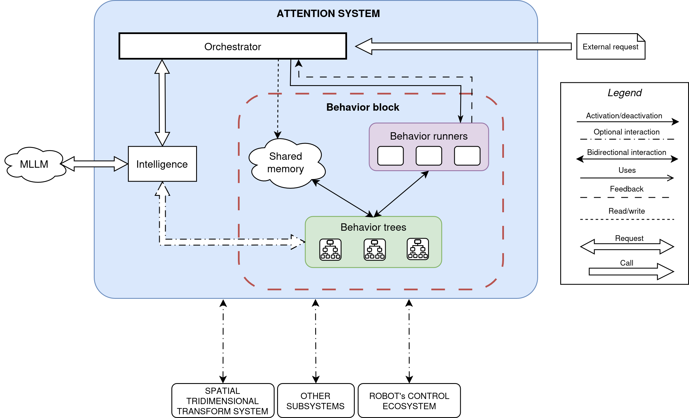

# attention_system


This repository contains the ROS 2 packages developed for an autonomous attention system for social robots. The system allows an external robotic architecture to request attention, while the internal components select, prepare and execute the most suitable attention behavior using MLLM-based reasoning and Behavior Trees.



### Author

Developed by Sergio Cobos Blanco ([dev-scobosb](https://github.com/dev-scobosb)).

## Additional documentation

- [Academic documentation](#academic-documentation): final degree thesis (TFG) and WAF26 paper related to this system.
- [ROS_INTERFACES.md](docs/guides/ROS_INTERFACES.md): public ROS nodes, services, topics and actions exposed by the system.
- [ADDING_ATTENTION_BEHAVIORS.md](docs/guides/ADDING_ATTENTION_BEHAVIORS.md): checklist for adding a new attention behavior.
- [VALIDATION_AND_TROUBLESHOOTING.md](docs/guides/VALIDATION_AND_TROUBLESHOOTING.md): validation commands and common runtime issues.

## Contents

- [Main features](#main-features)
- [Repository structure](#repository-structure)
- [Available attention behaviors](#available-attention-behaviors)
- [Usage](#usage)
  - [Installation](#installation)
  - [Quick start: TurtleBot 4 simulation](#quick-start-turtlebot-4-simulation)
  - [Running the system](#running-the-system)
    - [1. Robot actuation](#1-robot-actuation)
    - [2. Auxiliary perception system](#2-auxiliary-perception-system)
    - [3. MLLM](#3-mllm)
    - [4. Attention system](#4-attention-system)
    - [5. Requesting attention](#5-requesting-attention)
- [Troubleshooting](#troubleshooting)
- [Academic documentation](#academic-documentation)
- [License](#license)

## Main features

- ROS 2-based modular attention system.
- Attention behavior selection using MLLM-based reasoning.
- Attention behaviors implemented with Behavior Trees.
- Behavior orchestration, execution supervision and failure notification.
- Support for local and remote MLLM backends.
- Basic perception and actuation components for validation on TurtleBot 2 and NAO robot.

## Repository structure

The repository is organized into five main blocks: the core attention system, the attention behaviors, platform-specific actuation components, auxiliary perception components and MLLM management tools.

<details>
<summary>Show repository structure</summary>

| Package                                                                | Description                                                                                                                                                                   |
| ---------------------------------------------------------------------- | ----------------------------------------------------------------------------------------------------------------------------------------------------------------------------- |
| `attention_system_core/attention_system`                               | Core implementation of the attention system. It contains the attention orchestrator, the intelligence node, launch files and configuration files for the available behaviors. |
| `attention_system_core/attention_system_interfaces`                    | ROS 2 interfaces used by the core system, including the service used to request attention and the messages used to describe attention behaviors and system status.              |
| `attention_system_behaviors`                                           | Behavior Tree XML files and custom BehaviorTree.CPP nodes used to implement the attention behaviors.                                                                          |
| `attention_actuation/attention_actuation_msgs`                         | ROS 2 interfaces used by the actuation components, including tracking and body-turning requests.                                                                              |
| `attention_actuation/kobuki_attention_actuation`                       | Actuation implementation for TurtleBot 2/Kobuki. It provides a node for tracking a TF by rotating the mobile base.                                                            |
| `attention_actuation/tb4_attention_actuation`                          | Actuation implementation for TurtleBot 4. Same TF tracking node as Kobuki, with `Twist`/`TwistStamped` support and a launcher for the real robot or the `nav2_minimal_tb4_sim` simulation. |
| `attention_actuation/nao_attention_actuation`                          | Actuation implementation for NAO, including components for TF tracking with the neck and body turning with neck compensation.                                                 |
| `llm_management/llm_router/llm_router`                                 | Router node that exposes a common ROS 2 interface for querying different MLLM backends.                                                                                       |
| `llm_management/llm_router/llm_router_msgs`                            | ROS 2 service interface used by the LLM router.                                                                                                                               |
| `llm_management/gemini_bridge/gemini_bridge_interfaces`                | ROS 2 service interface used by the Gemini bridge.                                                                                                                            |
| `llm_management/gemini_bridge/google_gemini_bridge_cpp`                | C++ bridge used to send requests from ROS 2 to a remote Gemini model.                                                                                                         |
| `auxiliar_perception/attention_perception_launchers`                   | Launch package for starting the auxiliary perception components required by the implemented behaviors.                                                                        |
| `auxiliar_perception/omdet_turbo/omdet_node`                           | Open-vocabulary object detection node based on OMDet Turbo.                                                                                                                   |
| `auxiliar_perception/omdet_turbo/omdet_node_msgs`                      | ROS 2 service interface used to change the visual detection prompt.                                                                                                           |
| `auxiliar_perception/simple_perception/attention_aux_perception_msgs`  | ROS 2 service interfaces used by the auxiliary perception nodes.                                                                                                              |
| `auxiliar_perception/simple_perception/attention_aux_perception_nodes` | Auxiliary nodes that project 2D detections into 3D references and publish TFs associated with visual detections.                                                              |

Other files at the root of the repository:

| File | Description |
| ---- | ----------- |
| `thirdparty.repos` | Source dependencies common to every robot. |
| `repos/<robot>.repos` | Source dependencies of each robot platform (`tb4`, `nao`, `kobuki`). |
| `pixi.toml`, `pixi.lock` | pixi environments (one per robot) and build tasks. See [Installation](#installation). |
| `requirements.txt` | Python dependencies of `omdet_node`, for installations without pixi. |

</details>

## Available attention behaviors

The current behavior catalogue is loaded from `attention_system_core/attention_system/config/attention_orchestrator_params.yaml`.

<details>
<summary><code>TrackUnknownDetectionRot</code></summary>

Tracks one visual detection by class and id while rotating the robot/body toward it.
- Behavior runner: `attention_track_unknown_detection_rot`
- Required capabilities: `turn_around`
- MLLM inputs: `<int>id`, `<string>class`

</details>

<details>
<summary><code>TrackDetectionsSameClassMidpointRot</code></summary>

Tracks the midpoint of several detections of the same visual class.
- Behavior runner: `attention_track_detections_same_class_midpoint_rot`
- Required capabilities: `turn_around`
- MLLM inputs: `<string>class`, `<int>n_detections`

</details>

<details>
<summary><code>TrackJointArt</code></summary>

Tracks one robot joint frame when the robot should maintain visual contact with part of itself.
- Behavior runner: `attention_track_joint_art`
- Required capabilities: `use_joint`
- MLLM inputs: `<string>joint_frame`

</details>

## Usage

The system is a ROS 2 Jazzy workspace. Installing it means three steps: [create the workspace](#1-create-the-workspace), [fetch the sources](#2-fetch-the-sources) of the common dependencies and of **one** robot platform, and [build](#3-install-the-dependencies-and-build) only the packages of that robot, either with **pixi** (no system-wide ROS needed) or with a **system ROS 2 Jazzy** installation.

In the following commands, `<workspace>` is the path of the colcon workspace (for example `~/attention_ws`) and `<robot>` is one of:

| `<robot>` | Platform | Actuation package |
| --------- | -------- | ----------------- |
| `tb4` | TurtleBot 4, real robot or Gazebo simulation | `tb4_attention_actuation` |
| `nao` | NAO | `nao_attention_actuation` |
| `kobuki` | TurtleBot 2 / Kobuki (with the Astra camera) | `kobuki_attention_actuation` |

### Installation

#### 1. Create the workspace

```sh
mkdir -p <workspace>/src
cd <workspace>/src
git clone https://github.com/geriabot/attention_system.git
```

#### 2. Fetch the sources

The dependencies built from source are split into the ones common to every robot (`thirdparty.repos`) and the ones of each platform (`repos/<robot>.repos`). Fetch the common ones and those of your robot only; the actuation packages of the other robots are skipped at build time.

```sh
cd <workspace>/src

# Common dependencies
vcs import --recursive . < attention_system/thirdparty.repos
vcs import --recursive third_party < third_party/behavior_architecture/thirdparty.repos
vcs import attention_system/llm_management/gemini_bridge/google_gemini_bridge_cpp \
  < attention_system/llm_management/gemini_bridge/google_gemini_bridge_cpp/thirdparty.repos

# Dependencies of your robot (tb4, nao or kobuki)
vcs import --recursive . < attention_system/repos/<robot>.repos
```

> `vcstool` is needed for these commands (`sudo apt install python3-vcstool`, or `pixi global install vcstool`). `--recursive` is required: `nao_lola` includes `msgpack-c` as a git submodule.

#### 3. Install the dependencies and build

Choose **one** of the two options.

<details open>
<summary><b>Option A: pixi (recommended)</b></summary>

[pixi](https://pixi.sh) creates a self-contained ROS 2 Jazzy environment ([RoboStack](https://robostack.github.io)) with every dependency of the system, including the Python packages of the perception node and the TurtleBot 4 simulator. It works on any recent Linux distribution and does not need ROS installed on the system. The configuration is in [`pixi.toml`](pixi.toml), with one environment per robot (`tb4`, `nao`, `kobuki`).

Install pixi (only once):
```sh
curl -fsSL https://pixi.sh/install.sh | sh
```

Build the workspace for your robot. The first run downloads the environment (several GB, including PyTorch with CUDA):
```sh
cd <workspace>
pixi run --manifest-path src/attention_system -e <robot> build
```

The `build` task runs `colcon build --symlink-install --packages-up-to <common packages> <actuation package>` in `<workspace>`. Extra colcon arguments can be appended, for example `... build --packages-select tb4_attention_actuation`.

Then, **in every terminal** where you run the system, open the environment and source the workspace:
```sh
cd <workspace>
pixi shell --manifest-path src/attention_system -e <robot>
source install/setup.bash
```

> pixi commands look for `pixi.toml` in the current directory and its parents. Inside `src/attention_system` the `--manifest-path` option can be omitted (for example `pixi run -e tb4 build`).
>
> **Kobuki only**: `openni2_camera` links the system `libOpenNI2`, which is not available in conda-forge, so install it with `sudo apt install libopenni2-dev` before building.

</details>

<details>
<summary><b>Option B: system ROS 2 Jazzy (Ubuntu 24.04)</b></summary>

Requires [ROS 2 Jazzy](https://docs.ros.org/en/jazzy/Installation.html) installed on Ubuntu 24.04.

Install the system dependencies with rosdep (for `tb4` this includes the Gazebo simulator) and the Python dependencies of the perception node (`omdet_node`) with pip:
```sh
cd <workspace>
source /opt/ros/jazzy/setup.bash
rosdep install --from-paths src --ignore-src -r -y
pip install --break-system-packages -r src/attention_system/requirements.txt
```

Build only the packages of your robot. Replace `<actuation package>` with the one of the table above (for Kobuki, also add `kobuki`):
```sh
cd <workspace>
source /opt/ros/jazzy/setup.bash
colcon build --symlink-install \
  --packages-up-to attention_system attention_system_behaviors attention_perception_launchers \
    llm_router google_gemini_bridge_cpp llama_bringup llama_cli <actuation package> \
  --cmake-args -DCMAKE_EXPORT_COMPILE_COMMANDS=ON
```

> To use the `CUDA` GPU accelerator for local inference with `llama_ros`, add `-DGGML_CUDA=ON` to the `--cmake-args`.

Then, **in every terminal** where you run the system:
```sh
source /opt/ros/jazzy/setup.bash
source <workspace>/install/setup.bash
```

</details>

### Quick start: TurtleBot 4 simulation

This example runs the whole system in simulation with the remote Gemini backend. It needs the workspace built for `tb4` and a [Gemini API key](https://aistudio.google.com/apikey) in the `GEMINI_API_KEY` environment variable (it can be exported in `~/.bashrc`). Run each step in a **different terminal**, after preparing it as explained at the end of the [installation](#3-install-the-dependencies-and-build) (with pixi: `pixi shell --manifest-path src/attention_system -e tb4` and `source install/setup.bash`).

1. Simulation (Gazebo with a TurtleBot 4 in the `depot` world) and the actuation node:
```sh
ros2 launch tb4_attention_actuation tb4_attention.launch.py use_sim:=true
```

2. Auxiliary perception, using the RGB-D camera of the simulated robot:
```sh
ros2 launch attention_perception_launchers auxiliar_perception.launch.py use_sim_time:=true projector_mode:=rgbd
```

3. Configure and activate the detector. The node takes a few seconds to start (if `ros2 lifecycle` answers `Node not found`, wait and retry), and the first activation downloads the model:
```sh
ros2 lifecycle set /omdet_node 1
ros2 lifecycle set /omdet_node 3
```

4. MLLM router and Gemini backend (two terminals):
```sh
ros2 run llm_router llm_router --ros-args -p mode:=remote-gemini
```
```sh
export GEMINI_API_KEY=<your_api_key>   # not needed if it is already exported, e.g. in ~/.bashrc
ros2 run google_gemini_bridge_cpp gemini_bridge_node --ros-args -p model:=gemini-2.5-flash-lite
```

5. Attention system:
```sh
ros2 launch attention_system attention_system.launch.py use_sim_time:=true
```

6. Ask for attention. From its initial pose the robot faces two shelves, which OMDet detects reliably at that distance (smaller objects such as the boxes are too far away). Optionally, follow the system state in another terminal with `ros2 topic echo /attention_system/status`:
```sh
ros2 service call /use_attention attention_system_interfaces/srv/UseAttention \
  "{task_details: 'Keep looking at the shelf in front of you', behavior_details: '', can_turn_around: true, can_move_around: false, can_use_joint: false}"
```

The robot should start rotating until the shelf is in front of it, while `/attention_system/status` goes from `REASONING` (1) to `RUNNING` (2). For other robots or backends, see [Running the system](#running-the-system).

### Running the system

The system is made of five blocks, normally started in this order, each one in a different terminal prepared as explained at the end of the [installation](#3-install-the-dependencies-and-build). In simulation, pass `use_sim_time:=true` to the perception and attention system launchers (the TurtleBot 4 launcher already enables it with `use_sim:=true`).

#### 1. Robot actuation

Robot-specific node that executes the attention behaviors (turning the base or the head towards a TF). Launch the one of your robot:
```sh
# If using TurtleBot 2
ros2 launch kobuki_attention_actuation kobuki_attention.launch.py

# If using TurtleBot 4 (add use_sim:=true for the Gazebo simulation)
ros2 launch tb4_attention_actuation tb4_attention.launch.py

# If using NAO robot
ros2 launch nao_attention_actuation nao_attention.launch.py
```

> On the real robots, the robot bringup must be running first. The TurtleBot 4 bringup runs on the robot itself; the Kobuki launcher starts it (`kobuki` package).
>
> TODO: Document complete hardware bringup prerequisites for real TurtleBot 2/Kobuki and NAO deployments.

<details>
<summary>Kobuki launcher arguments</summary>

| Argument | Default value | Description |
| -------- | ------------- | ----------- |
| `use_sim` | `false` | Launches the Kobuki simulation instead of the real robot launch. |
| `use_sim_time` | `false` | Uses the ROS simulation clock when enabled. |
| `base_frame_id` | `base_link` | Base TF frame used by the TF tracking node. |
| `cmd_vel_topic` | `/cmd_vel` | Velocity command topic used by the TF tracking node. |
| `control_period_ms` | `100` | Control period of the TF tracking node, in milliseconds. |
| `yaw_kp` | `4.0` | Proportional gain for yaw control. |
| `yaw_ki` | `0.0` | Integral gain for yaw control. |
| `yaw_kd` | `0.01` | Derivative gain for yaw control. |
| `max_angular_speed` | `1.5` | Maximum angular speed sent by the TF tracking node. |
| `yaw_deadband` | `0.001` | Yaw error deadband used by the TF tracking node. |
| `publish_test_traces` | `true` | Publishes test trace topics from the TF tracking node. |

</details>

<details>
<summary>TurtleBot 4 launcher arguments</summary>

| Argument | Default value | Description |
| -------- | ------------- | ----------- |
| `use_sim` | `false` | Launches the `nav2_minimal_tb4_sim` Gazebo simulation, remapping `/rgbd_camera/image` to `/image_rgb`. On the real robot the bringup runs on the TurtleBot 4 itself. |
| `use_sim_time` | `use_sim` | Uses the ROS simulation clock when enabled. |
| `headless` | `False` | Runs the simulation without the Gazebo GUI. |
| `world` | `depot.sdf` | Gazebo world used by the simulation. |
| `image_topic` | `/oakd/rgb/preview/image_raw` | Real robot RGB topic relayed to `/image_rgb` for perception (not used in simulation). |
| `use_stamped_cmd_vel` | `not use_sim` | Publishes `geometry_msgs/TwistStamped` (real TurtleBot 4 on Jazzy) instead of `Twist` (`nav2_minimal_tb4_sim`). |
| `base_frame_id`, `cmd_vel_topic`, `control_period_ms`, `yaw_kp`, `yaw_ki`, `yaw_kd`, `max_angular_speed`, `yaw_deadband`, `publish_test_traces` | Same as Kobuki | Same meaning as in the Kobuki launcher. |

</details>

<details>
<summary>NAO launcher arguments</summary>

| Argument | Default value | Description |
| -------- | ------------- | ----------- |
| `track_head_frame_id` | `Head` | Head TF frame used by the neck TF tracking node. |
| `track_yaw_kp` | `0.1` | Proportional gain for neck yaw tracking. |
| `track_pitch_kp` | `0.1` | Proportional gain for neck pitch tracking. |
| `track_max_yaw_delta_per_tick` | `0.2` | Maximum yaw correction per tick for neck tracking. |
| `track_max_pitch_delta_per_tick` | `0.2` | Maximum pitch correction per tick for neck tracking. |
| `track_yaw_deadband` | `0.01` | Yaw error deadband used by the neck tracking node. |
| `track_pitch_deadband` | `0.01` | Pitch error deadband used by the neck tracking node. |
| `track_min_head_yaw` | `-1.0` | Minimum head yaw allowed by the neck tracking node. |
| `track_max_head_yaw` | `1.0` | Maximum head yaw allowed by the neck tracking node. |
| `track_min_head_pitch` | `-0.5` | Minimum head pitch allowed by the neck tracking node. |
| `track_max_head_pitch` | `0.3` | Maximum head pitch allowed by the neck tracking node. |
| `track_publish_test_traces` | `false` | Publishes test trace topics from the neck tracking node. |
| `body_reference_frame` | `odom` | Reference TF frame used by body turn with neck compensation. |
| `body_base_frame_id` | `base_link` | Base TF frame used by body turn with neck compensation. |
| `body_head_frame_id` | `Head` | Head TF frame used by body turn with neck compensation. |
| `body_control_period_ms` | `100` | Control period for body turn with neck compensation, in milliseconds. |
| `body_turn_speed` | `0.2` | Body turning speed used during neck compensation. |
| `body_yaw_kp` | `0.1` | Proportional gain for body yaw control. |
| `body_max_yaw_delta_per_tick` | `0.2` | Maximum yaw correction per tick for body turning. |
| `body_yaw_deadband` | `0.01` | Yaw error deadband used by body turn with neck compensation. |
| `body_min_head_yaw` | `-1.0` | Minimum head yaw used by body turn with neck compensation. |
| `body_max_head_yaw` | `1.0` | Maximum head yaw used by body turn with neck compensation. |
| `body_tf_lookup_timeout_ms` | `100` | TF lookup timeout for body turn with neck compensation, in milliseconds. |
| `body_max_tf_failures_before_abort` | `5` | Maximum consecutive TF lookup failures before aborting the body turn action. |

</details>

#### 2. Auxiliary perception system

Open-vocabulary object detection (OMDet Turbo, reads `/image_rgb`) plus the nodes that project the detections to 3D and publish them as TFs:
```sh
ros2 launch attention_perception_launchers auxiliar_perception.launch.py
```

<details>
<summary>Launcher arguments</summary>

| Argument | Default value | Description |
| -------- | ------------- | ----------- |
| `use_sim_time` | `false` | Uses the ROS simulation clock when enabled. |
| `projector_mode` | `no_depth_cam` | Selects the 3D detection projector implementation. Valid values are `no_depth_cam`, `astra` (only built when `astra_camera_msgs` is available, i.e. with the Kobuki dependencies) and `rgbd` (reads `/rgbd_camera/*`, as in the TurtleBot 4 simulation). |

</details>

`/omdet_node` is a lifecycle node and does nothing until it is configured and activated. Execute this in a different terminal after launching the perception system (the first activation downloads the OMDet Turbo model, about 450 MB, from Hugging Face):
```sh
ros2 lifecycle set /omdet_node 1
ros2 lifecycle set /omdet_node 3
```

The classes to detect are set at runtime by the attention behaviors through the `/omdet_prompt` service. To test perception alone:
```sh
ros2 service call /omdet_prompt omdet_node_msgs/srv/SetDetectionPrompt "{prompt: box}"
ros2 topic echo /detections_2d
```

#### 3. MLLM

The attention system queries the MLLM through the `/llm_router` node, which forwards each request to the selected backend. Start the router:
```sh
ros2 run llm_router llm_router --ros-args -p mode:=<local/remote-gemini>
```

And one backend (`mode:=remote-gemini` uses the first one, `mode:=local` the second):

> The Gemini bridge reads the API key from the `GEMINI_API_KEY` environment variable (also `GOOGLE_API_KEY`, or the legacy `GOOGLE_GEMINI_API_KEY`). The log shows which variable was used, never the key.
```sh
# For Gemini remote client
export GEMINI_API_KEY=<your_api_key>   # not needed if it is already exported, e.g. in ~/.bashrc
ros2 run google_gemini_bridge_cpp gemini_bridge_node --ros-args -p model:=gemini-2.5-flash-lite

# For llama_ros local client
# TODO: Add a validated local model YAML file path for this repository.
ros2 llama launch <path_to_model_yaml_file>
```

#### 4. Attention system

Attention system (`/attention_orchestrator`, `/attention_intelligence`, `/attention_system_bt_node`, and behavior runners):
```sh
ros2 launch attention_system attention_system.launch.py
```

The launcher starts the generic `behavior_architecture` `mission_executor` with two configuration files from the `attention_system` package. Together, these files describe both the Behavior Tree runtime and the attention-specific behavior selection data.

<details>
<summary>Launcher arguments</summary>

| Argument | Default value | Description |
| -------- | ------------- | ----------- |
| `use_sim_time` | `false` | Uses the ROS simulation clock when enabled. |

</details>

<details>
<summary>Behavior Tree runtime configuration</summary>

`config/attention_behaviors_config.yaml` is passed as the positional configuration file to `mission_executor`.

This file tells `behavior_architecture` which orchestrator and Behavior Tree runners must be created:

```yaml
node_name: "attention_system_bt_node"
orchestrator_type: "attention_orchestrator"
package_name: "attention_system"

orchestrator_libraries:
  - "libattention_system.so"

plugin_libraries:
  - "libattention_system_behaviors_bt_plugins.so"

behaviors:
  - name: "attention_track_unknown_detection_rot"
    behavior_file: "behavior_tree_xml/track_unknown_detection_rot.xml"
    control_period_ms: 100
    package_name: "attention_system_behaviors"
```

| Field | Meaning |
| ----- | ------- |
| `node_name` | Name of the shared ROS 2 node created by `mission_executor` and stored in the BehaviorTree.CPP blackboard as `node`. The custom BT nodes use this node to create ROS publishers, clients and other ROS interfaces. |
| `orchestrator_type` | Registered orchestrator type to load from the orchestrator plugin library. |
| `package_name` | Package where the orchestrator plugin library is located. |
| `orchestrator_libraries` | Shared libraries that provide the attention orchestrator plugin. |
| `plugin_libraries` | Shared libraries that provide the custom BehaviorTree.CPP nodes used by the XML trees. |
| `behaviors` | List of BehaviorRunner nodes to create. Each entry defines the runner name, XML file, control period and package that contains the XML. |

When adding a new attention behavior, this file is where the new BehaviorRunner is registered and linked to its Behavior Tree XML file. See [docs/guides/ADDING_ATTENTION_BEHAVIORS.md](docs/guides/ADDING_ATTENTION_BEHAVIORS.md) for the complete checklist.

</details>

<details>
<summary>Attention orchestrator configuration</summary>

`config/attention_orchestrator_params.yaml` is loaded as ROS 2 parameters for the `/attention_orchestrator` node created by `mission_executor`.

This file describes the information used by the attention system to decide which behavior can satisfy an attention request:

```yaml
/attention_orchestrator:
  ros__parameters:
    context_details: [...]
    actuation_capabilities: ["turn_around", "move_around", "use_joint"]

    attention_behaviors:
      behaviors: ["TrackUnknownDetectionRot", "TrackDetectionsSameClassMidpointRot", "TrackJointArt"]

      TrackUnknownDetectionRot:
        behavior_id: 0
        actuation_capabilities_needed:
          turn_around:
            needed: true
        prompt_information:
          explanation: "..."
          inputs: ["<int>id", "<string>class"]
        bt_blackboard_inputs:
          not_assigned: ["det_id", "det_class"]
          assigned: ["det_prompt_topic:omdet_prompt"]
        node_name: "attention_track_unknown_detection_rot"
```

The global fields are:

| Field | Meaning |
| ----- | ------- |
| `context_details` | List of extra rules added to the attention context. They guide the MLLM when it generates behavior inputs, especially visual detection class names. |
| `actuation_capabilities` | List of capability names known by the attention system. The orchestrator iterates over this list when reading the capability requirements of each behavior. |
| `attention_behaviors` | Root group for all behavior-selection parameters. |
| `attention_behaviors.behaviors` | List of behavior keys to load from the same YAML group. Every name in this list must have a matching behavior block below it. |

Each behavior listed in `attention_behaviors.behaviors` has this structure:

| Field | Meaning |
| ----- | ------- |
| `<BehaviorName>` | Behavior description key used by the orchestrator and the MLLM-facing behavior catalogue, for example `TrackUnknownDetectionRot`. |
| `<BehaviorName>.behavior_id` | Numeric identifier used internally to store and retrieve the behavior description. It must be unique among the configured attention behaviors. |
| `<BehaviorName>.actuation_capabilities_needed` | Capability requirements for this behavior. It must define entries for the capabilities listed in `actuation_capabilities`. |
| `<BehaviorName>.prompt_information` | Information exposed to the MLLM so it can decide when to use the behavior and which inputs it must provide. |
| `<BehaviorName>.bt_blackboard_inputs` | Blackboard values that will be passed to the Behavior Tree when this behavior is selected. |
| `<BehaviorName>.node_name` | BehaviorRunner name to activate for this attention behavior. The orchestrator passes this value to `activate_runner()`, so it must match the corresponding `behaviors.name` entry in `attention_behaviors_config.yaml`. |

Each capability entry inside `actuation_capabilities_needed` has this structure:

| Field | Meaning |
| ----- | ------- |
| `<capability>.needed` | Indicates whether the behavior requires that capability. For example, `turn_around.needed: true` means the behavior requires body/base rotation. |
| `<capability>.alternatives` | List of alternative capability names that can replace this capability. An empty placeholder list, `[""]`, means there are no alternatives configured. |

The `prompt_information` fields are:

| Field | Meaning |
| ----- | ------- |
| `prompt_information.explanation` | Natural-language description of what the behavior does. The orchestrator prefixes it with the behavior name before using it in the prompt data. |
| `prompt_information.inputs` | Input schema expected from the MLLM for that behavior. Entries include the expected type and semantic name, such as `<int>id` or `<string>class`. |

The `bt_blackboard_inputs` fields are:

| Field | Meaning |
| ----- | ------- |
| `bt_blackboard_inputs.not_assigned` | Blackboard keys whose values must be produced for each request, normally from the selected behavior inputs. |
| `bt_blackboard_inputs.assigned` | Fixed blackboard assignments injected when the behavior runs. Each entry uses the `key:value` format. Typed values can use prefixes such as `<int>` or `<double>`, for example `retry_attempts:<int>5`. |

When adding a new attention behavior, this file is where the behavior is exposed to the selection logic, described for the MLLM and connected to the BehaviorRunner declared in `attention_behaviors_config.yaml`.

</details>

#### 5. Requesting attention

An external architecture (or you, from a terminal) asks for attention through the `/use_attention` service, describing the task in natural language and stating which actuation capabilities the robot offers:

```sh
ros2 service call /use_attention attention_system_interfaces/srv/UseAttention \
  "{task_details: 'Keep looking at the box in front of you', behavior_details: '', can_turn_around: true, can_move_around: false, can_use_joint: false}"
```

| Robot | `can_turn_around` | `can_move_around` | `can_use_joint` |
| ----- | ----------------- | ----------------- | --------------- |
| TurtleBot 2 / TurtleBot 4 | `true` | `false` | `false` |
| NAO | `true` | `false` | `true` |

The MLLM selects a behavior whose required capabilities are satisfied (see [Available attention behaviors](#available-attention-behaviors)), fills its inputs (e.g. the class to detect) and the system starts tracking. The response contains a `status` (`0` = `SUCCESSFUL`, `3` = `NO_ATTENTION_BEHAVIORS_AVAILABLE`, ...) and the target `frame_id`. Follow the progress with:

```sh
ros2 topic echo /attention_system/status   # 0 IDLE, 1 REASONING, 2 RUNNING, 3 FAILED
```

The request and response fields are described in [ROS_INTERFACES.md](docs/guides/ROS_INTERFACES.md).

## Troubleshooting

- If dependencies are missing, run `rosdep install --from-paths src --ignore-src -r -y`.
- If a package of another robot fails to build (for example `nao_attention_actuation` when only the TurtleBot 4 dependencies were fetched), build with `--packages-up-to` as explained in [Installation](#3-install-the-dependencies-and-build) instead of building the whole workspace.
- If `nao_lola` fails with `msgpack.hpp: No such file or directory`, its git submodules are missing: run `git -C src/third_party/nao_lola submodule update --init`.
- If `pixi` reports that it cannot find a manifest, run it from `<workspace>/src/attention_system` or add `--manifest-path src/attention_system`.
- If `/omdet_node` takes long to activate, it is downloading the OMDet Turbo model (first time only). If activation fails, check its terminal: the model needs the `timm` Python package.
- If local MLLM inference is too slow, check whether CUDA support was enabled during `llama_ros` compilation.
- If a Behavior Tree cannot be loaded, check that the plugin libraries are correctly built and sourced.
- If no attention behavior is selected, check the available actuation capabilities and the behavior configuration file.
- For runtime checks and common failures, see [docs/guides/VALIDATION_AND_TROUBLESHOOTING.md](docs/guides/VALIDATION_AND_TROUBLESHOOTING.md).

## Academic documentation

This repository is the result of a final degree thesis focused on designing and building an autonomous attention system for social robots.

### Thesis

**Title:** [Sistema Inteligente de Atención Autónoma para Robots Sociales](https://hdl.handle.net/10115/444617)  
**Author:** Sergio Cobos Blanco  
**Advisors:** Rodrigo Pérez Rodríguez and Juan Diego Peña Narváez  
**Degree:** Bachelor's Degree in Software Robotics Engineering  
**Institution:** Universidad Rey Juan Carlos  
**Year:** 2026  
**Language:** Spanish  
**Description:** Final degree thesis document in which this attention system was developed.

### Paper

**Title:** *An Autonomous Attention System for Social Robots Based on Multimodal Reasoning and Behavior Trees*  
**Status:** Accepted and to be presented at WAF26 ([you can find the paper in this list](https://waf26.unex.es/wp-content/uploads/2026/08/WAF2026_Proceedings_Final.pdf)).

## License
This project is licensed under the **Apache License 2.0**. See the [LICENSE](./LICENSE) file for details.